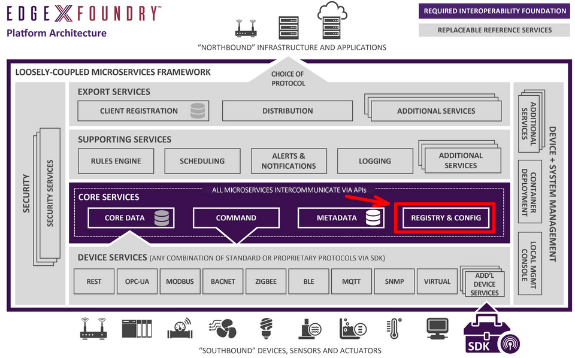
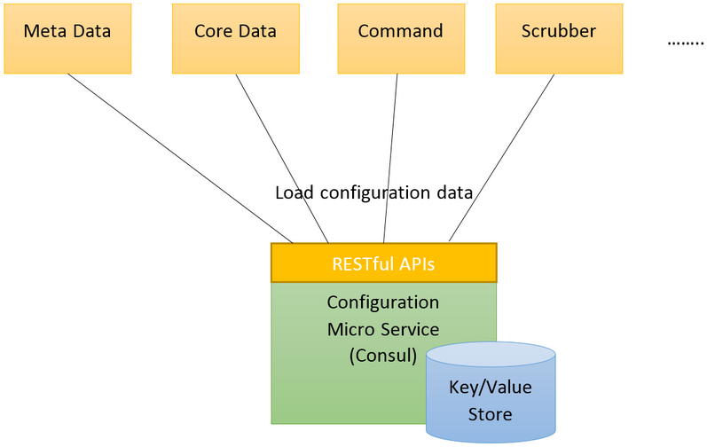
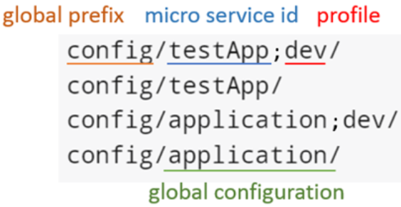
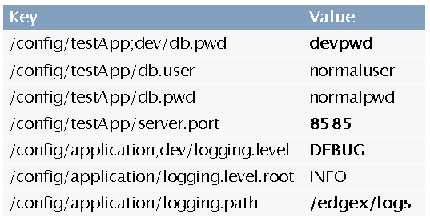
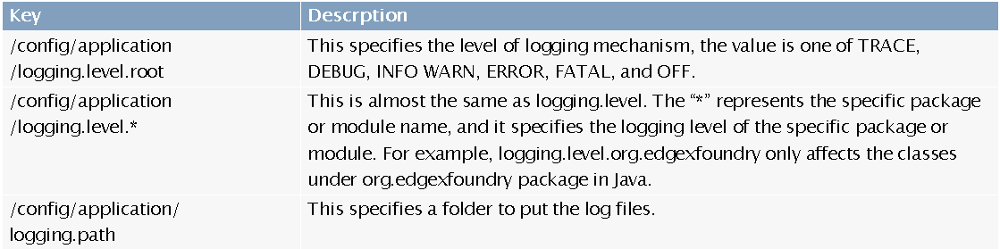
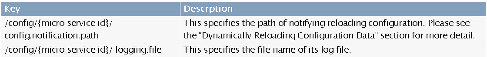

# 2.1.1  配置与注册

## 1 简介

* 每个微服务启动的时候，为其提供配置信息。
* 配置改变时，发送通知给微服务；微服务可注册以接收这种通知，并响应配置改变通知。
* 配置与注册服务了解所有微服务的位置和操作状态。
    * 微服务启动的时候，必须将自身注册到配置和注册微服务中。
    * 配置和注册微服务会ping其他微服务，这样就可以为其他微服务、管理系统、第三方应用等提供一个获取EdgeX状态的地方
* 没有配置和注册微服务的情况下，EdgeX微服务也可以运行。但是此时，微服务使用内置的配置运行、在本地操作、只能假设其他微服务的位置和操作状态。

## 2 配置

* 配置微服务内部使用[Consul](https://www.consul.io/)提供的键值存储，为客户端提供RESTful API
* 每个微服务在启动阶段，试图通过RESTful API联系配置服务，根据命名习惯获取自身的配置信息

### 2.1 命名习惯

* 键值存储中的每个键对应一个配置条目，比如说`/config/core-metadata/server.port`定义核心元数据服务的端口号。
* 所有的配置键应该存储在`/config`中，然后用微服务ID作为第二层名字空间
* 配置文件（profiles）是一种条件配置。如果微服务支持基于配置文件的配置，则配置文件名加在第二层名字空间后面，用分号分隔。
* `config/application`中的配置应用到所有微服务
* 最特定的配置数据的优先级最高

* 下图中粗体字表示的配置条目将被使用

### 2.2 全局配置

### 2.3 服务级别的配置

### 2.4 Web界面

* 默认地址为[http://localhost:8500/ui](http://localhost:8500/ui)，可参考[Consul Web UI文档](https://www.consul.io/intro/getting-started/ui.html)
* 配置微服务首次启动时，Consul键值存储为空。`core-config-seed`微服务启动，从property或者YAML文件中加载默认配置，存储到键值存储中。
* 如果客户端微服务需要动态重新加载配置，又不是基于Spring Cloud Consul的，则需要实现一个回调API以实现重新加载动作。
* 整个重新加载过程如下：
  1. 简单工具`core-config-watcher`监测到键值存储中的键值的改变，向`fuse-core-config-watcher`工具发送相关微服务ID，比如说`core-data`
  2. `fuse-core-config-watcher`工具查询`/config/{微服务ID}/config.notification.path`的值，即通知路径，比如说`/ping?config_changed=true`。如果查询不到通知路径，则退出。
  3. `fuse-core-config-watcher`工具查询服务的地址和端口号：通过发送请求到`http://localhost:8500/v1/catalog/service/core-data(微服务ID)`实现，比如说`https://core-data:48080`
  4. `fuse-core-config-watcher`工具根据第2、3步骤取得的服务地址、端口号、通知路径，发送配置改变配置：`https://core-data:48080/ping?config_changed=true`
