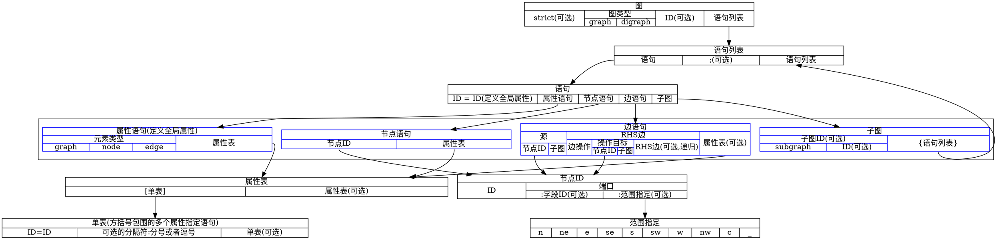

# Dot语言

* Graphviz文档：[https://graphviz.gitlab.io/documentation/](https://graphviz.gitlab.io/documentation/)
* Dot语言：[https://graphviz.gitlab.io/_pages/doc/info/lang.html](https://graphviz.gitlab.io/_pages/doc/info/lang.html)

## 1 语法概要

* 图 : [ **strict** ] (**graph** | **digraph**) [ ID ] '{' 语句列表 '}'
* 语句列表 	: 	[ 语句 [ ';' ] 语句列表 ]
* 语句 	: 	节点语句 | 边语句 | 属性语句 | ID '=' ID | 子图
* 属性语句 : 	(**graph** | **node** | **edge**) 属性表
* 属性表: 	'[' [ 单表 ] ']' [ 属性表 ]
* 单表 	: 	ID '=' ID [ (';' | ',') ] [ 单表 ]
* 边语句 	: 	(节点ID | 子图) RHS边 [ 属性表 ]
* RHS边 	: 	edgeop (节点ID | 子图) [ RHS边 ]
* 节点语句 	: 	节点ID [ 属性表 ]
* 节点ID 	: 	ID [ 端口 ]
* 端口 	: 	':' ID [ ':' compass_pt ] | ':' compass_pt
* 子图 	: 	[ **subgraph** [ ID ] ] '{' 语句列表 '}'
* compass_pt	: 	(**n** | **ne** | **e** | **se** | **s** | **sw** | **w** | **nw** | **c** | **_**)

### 1.1 ID

ID 可以是：

* 由字母、数字、下划线组成的字符串，不以数字开头
* 表示数值的字符串
* 带双引号的字符串，其中可以含有转义的双引号：关键字可以用作ID，但必须带双引号
* HTML字符串

### 1.2 边操作

* `->`用于有向图
* `--`用于无向图

### 1.3 注释

* 支持C++风格的注释：`/* */` 或者`//`
* 以`#`开头的行被C预处理器当做行输出

### 1.4 其他

* 分号和逗号可增加可读性，但不是必须的
* 带双引号的字符串中行末尾可使用续行符`\`将字符串扩展成多行
* 可用加号`+`连接多个带双引号的字符串

## 2 子图和集群

子图的作用

1. 代表图结构：指示某些节点和边应该组成一组。例如：`A -> {B C}`等价于两个语句：`A -> B`和`A -> C`。组可以用在箭头左边和右边。
2. 提供设置属性的上下文，比如说：`subgraph { rank=same; A; B; C; }` 表示要求将三个节点绘制在同一个等级。
3. 对于某些布局引擎，直接决定布局方式。如果名称以`cluster`开头，则子图被当做特殊的集群子图。如果引擎支持，则属于集群的节点将绘制在一起，并且外部有一个矩形框包围。DOT语言不支持集群子图，它仅仅由某些布局引擎支持。

## 3 词法和语义

### 3.1 有向图与无向图

* `digraph`：有向图，必须用`->`作为边操作符
* `graph`：无向图，必须用`--`作为边操作符

### 3.2 严格模式

* `strict`：禁止创建两个节点间的多条边。
  * 对于无向图，两个节点间只能有一条边；后续相同的边语句将应用新属性到已有的边。
  * 对于有向图，两个节点间至多有两条边，两个方向各一条；后续相同（节点和方向都相同）的边语句将应用新属性到已有的边。

### 3.3 默认属性

* `node`、`edge`、`graph`语句可以定义节点、边、图的默认属性；不关联到节点和边的属性赋值语句将定义默认属性
* 上述默认属性定义将应用到后面定义的、含有指定属性的任何对象
* 子图也会从父图继承属性设置
* 边属于集群时，边连接的节点也属于集群
* 子图与父图共享名字空间

## 4 字符编码

* 默认假定使用UTF-8编码，至少支持ASCII字符集
* 可以用`charset`属性指定字符集
