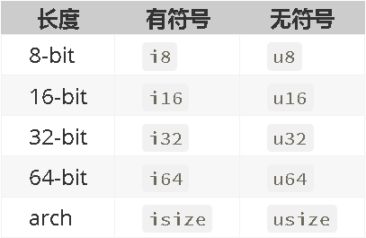
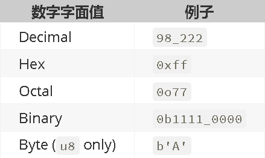

# 第03章 通用编程概念

## 1 常量与变量

### 1.1 常量

* 用`const`定义常量时，必须给出类型
* 常量名称由大写字母和下划线组成，不遵循此规范会出编译警告：`note: #[warn(non_upper_case_globals)] on by default`
* 可以用`#[allow(non_upper_case_globals)]`注解关闭警告
* 可以在全局范围（非函数/方法中）定义常量

```rust
#[allow(non_upper_case_globals)]
mod a{
    pub const pi : f64 = 3.14;
}

fn main(){
    println!("{}",a::pi);
}
```

### 1.2 变量

- 用let定义变量，通常使用自动类型推导，也可以变量名后加冒号和类型来指定类型
- 默认是不可变的，可以用mut指定是可变的
- 对不可变变量重新赋值会出现编译错误
- 可重复使用let定义同名变量，这就是 **变量遮盖(shadow)** ,遮盖时可修改变量类型
- 可以在全局范围定义变量，但是不建议这样使用，因为访问全局范围定义的静态变量时需要使用`unsafe`，详见第19章《高级特征》的1.3节

## 2 数据类型

### 2.1 标量类型

#### 2.1.1 整数

* 字面整数值的类型默认为`i32`
* 字面数值类型中可以使用下划线以增加可读性
* <font color="red">Rust 1.26.0 增加了`i128`和`u128`类型，由`LLVM`支持</font>



#### 2.1.2 浮点数

* 有`f32`和`f64`两种类型，字面值的类型默认为`f64`

#### 2.1.3 布尔型

* 布尔型`bool`有两种值：`true`和`false`

#### 2.1.4 字符类型

* 字符类型`char`的字面值用单引号表示
* 一个字符类型的值表示一个Unicode字符，可以表示中文

### 2.2 复合类型

#### 2.1.1 元组

```rust
fn main() {
    let x: (i32, f64, u8) = (500, 6.4, 1);
    let (a,b,c) = x;
    let r = x.0;
    let s = x.1;
    let t = x.2;
    println!("a={} b={} c={} r={} s={} t={}",a,b,c,r,s,t);
}
```

#### 2.1.2 数组与切片

* 数组长度是固定的，在栈上为数组分配内存，`[T;N]`表示有`N`个类型为`T`的元素的数组
* 切片是数组片段的引用，表示为`&V[d..u]`，其中`V`为数组变量名，`d`为第一个元素下标，`u`是最后一个元素的下标减一（不包含下标为`u`的元素）
* 切片`&V[d..u]`中的两个下标都可以省略
* `Vec<T>`是标准库提供的一种泛型类型，可以看做是动态数组

```rust
fn main() {
    // 数组类型说明可以省略
    let mut array : [i32;5] = [1,2,3,4,5];
    for v in &mut array[..]{
        *v = *v + 100;
        println!("{}",v);
    }
    // 数据类型说明可以省略
    let mut array : Vec<i32> = vec![1,2,3];
    array.push(4);
    array.push(5);
    for v in &mut array{
        *v = *v * 2;
        println!("{}",v);
    }
}
```

#### 2.1.3 结构体

```rust
#[allow(unused_variables)]
#[allow(dead_code)]
fn main() {
    struct User {
        username: String,
        email: String,
        sign_in_count: u64,
        active: bool,
    };

    let mut user1 = User {
        email: String::from("someone@example.com"),
        username: String::from("someusername123"),
        active: true,
        sign_in_count: 1,
    };

    user1.email = String::from("anotheremail@example.com");
}
```

* 只能标记结构体变量为`mut`，不能标记单个字段为`mut`，但可以对单个字段使用`pub`标记

##### 2.1.3.1 变量名与字段名相同时结构体初始化的简略写法

```rust
fn build_user(email: String, username: String) -> User {
    User {
        email,// 完整写法是: email: email
        username,// 完整写法是: username: username
        active: true,
        sign_in_count: 1,
    }
}
```

##### 2.1.3.2 结构体更新语法

```rust
let user2 = User {
    email: String::from("another@example.com"),
    username: String::from("anotherusername567"),
    ..user1 // 其他字段从user1复制
};
```

#### 2.1.4 枚举

##### 2.1.4.1 定义和使用枚举

```rust

#[allow(unused_variables)]
#[allow(dead_code)]
fn main() {
    enum IpAddrKind {
        V4,
        V6,
    }

    struct IpAddr {
        kind: IpAddrKind,
        address: String,
    }

    let home = IpAddr {
        kind: IpAddrKind::V4,
        address: String::from("127.0.0.1"),
    };

    let loopback = IpAddr {
        kind: IpAddrKind::V6,
        address: String::from("::1"),
    };
}
```

##### 2.1.4.2 枚举值关联到其他类型

```rust
enum Message {
    Quit,
    Move { x: i32, y: i32 },// 关联到一个结构体
    Write(String), // 关联到String
    ChangeColor(i32, i32, i32),// 关联到一个元组
}
```

## 3 控制流

* 表达式与语句：通常语句以分号结束，而表达式末尾不能加分号，加了就是语句了
* 函数体中最后一个表达式的值就是函数的返回值，个人建议还是明确地用`return`来返回值比较好
* 控制语句
  * `if`语句（含`let if`）
  * `while`语句（含`while let`）
  * `loop`表示无限循环，<font color="red">可用`break 表达式;`从循环中返回一个值（注意：仅能用于`loop`循环）</font>
  * `for`语句用于遍历各种集合类型

## 4 注释

* 支持C++风格的单行和多行注释
* 支持`///`开始的行注释，表示对后面项的注释，其中可使用Markdown
* 支持`//!`开始的行注释，表示对包含注释的项的注释，其中可以使用Markdown