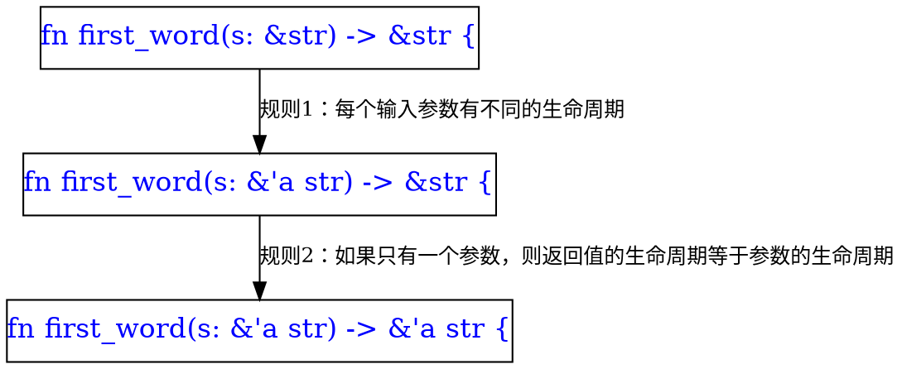
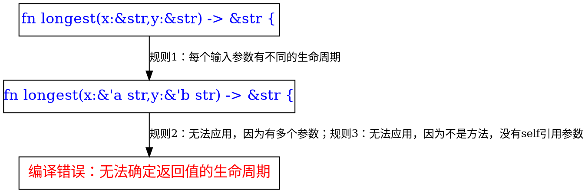

# 第10章 泛型、特性与生命周期

## 0 前言

### 0.0 重复的代码

```rust
fn main() {
    let number_list = vec![34, 50, 25, 100, 65];

    let mut largest = number_list[0];

    for number in number_list {
        if number > largest {
            largest = number;
        }
    }

    println!("The largest number is {}", largest);

    let number_list = vec![102, 34, 6000, 89, 54, 2, 43, 8];

    let mut largest = number_list[0];

    for number in number_list {
        if number > largest {
            largest = number;
        }
    }

    println!("The largest number is {}", largest);
}
```

### 0.1 使用函数抽象重复的部分

```rust
fn largest(list: &[i32]) -> i32 {
    let mut largest = list[0];

    for &item in list.iter() {
        if item > largest {
            largest = item;
        }
    }

    largest
}

fn main() {
    let number_list = vec![34, 50, 25, 100, 65];
    let result = largest(&number_list);
    println!("The largest number is {}", result);

    let number_list = vec![102, 34, 6000, 89, 54, 2, 43, 8];
    let result = largest(&number_list);
    println!("The largest number is {}", result);
}
```

* 遗留问题：如果有两个函数，一个用于寻找元素类型为`i32`的切片中的最大值；另一个寻找元素类型为`char`的切片中的最大值，这时候该如何消除重复？

## 1 泛型

### 1.1 函数中的泛型

#### 1.1.1 重复的函数

*  下面代码中的`largest_i32`和`largest_char`函数仅参数和返回值的类型不同，函数体完全相同，这是一种重复

```rust
fn largest_i32(list: &[i32]) -> i32 {
    let mut largest = list[0];
    for &item in list.iter() {
        if item > largest {
            largest = item;
        }
    }
    largest
}

fn largest_char(list: &[char]) -> char {
    let mut largest = list[0];
    for &item in list.iter() {
        if item > largest {
            largest = item;
        }
    }
    largest
}

fn main() {
    let number_list = vec![34, 50, 25, 100, 65];

    let result = largest_i32(&number_list);
    println!("The largest number is {}", result);
   assert_eq!(result, 100);

    let char_list = vec!['y', 'm', 'a', 'q'];

    let result = largest_char(&char_list);
    println!("The largest char is {}", result);
   assert_eq!(result, 'y');
}
```

#### 1.1.2 使用泛型避免重复

```rust
#![allow(dead_code)]

use std::cmp::PartialOrd;

fn largest<T>(list :&[T]) -> T where T: Clone + PartialOrd{
    let mut max  = &list[0];
    for cur in list.iter(){
        if cur > max{
            max = cur;
        }
    }
    max.clone()
}

// 注意: 两种写法的差别
fn largest2<T>(list :&[T]) -> T where T: Clone + PartialOrd{
    let mut max  = list[0].clone();
    for cur in list.iter(){
        // 写成 cur > &max 也可以,但是 cur > max 不行
        // 因为 > 要求调用 PartialOrd 的 fn partial_cmp(&self, other: &Rhs) -> Option<Ordering>; 方法
        // 第二个参数必须是引用类型
        if *cur > max{
            max = cur.clone();
        }
    }
    max
}

pub fn main() {
    let number_list = vec![34, 50, 25, 100, 65];

    let result = largest(&number_list);
    println!("The largest number is {}", result);
    assert_eq!(result, 100);

    let char_list = vec!['y', 'm', 'a', 'q'];

    let result = largest(&char_list);
    println!("The largest char is {}", result);
    assert_eq!(result, 'y');
}
```

### 1.2 结构体中的泛型

#### 1.2.1 单个泛型类型

```rust
// 要求x,y的类型相同
struct Point<T> {
    x: T,
    y: T,
}

fn main() {
    let integer = Point { x: 5, y: 10 };
    let float = Point { x: 1.0, y: 4.0 };
    // 这里不正确: x,y的类型不一致
    // let wont_work = Point { x: 5, y: 4.0 };
}
```

#### 1.2.2 多个泛型类型

```rust
struct Point<T, U> {
    x: T,
    y: U,
}

fn main() {
    let both_integer = Point { x: 5, y: 10 };
    let both_float = Point { x: 1.0, y: 4.0 };
    // 允许x,y的类型不同
    let integer_and_float = Point { x: 5, y: 4.0 };
}
```

### 1.3 枚举中的泛型

* 标准库中的`std::option::Option`和`std::result::Result`枚举类型使用了泛型

```rust
pub enum Option<T> {
    None,
    Some(T),
}
```

```rust
pub enum Result<T, E> {
    Ok(T),
    Err(E),
}
```

### 1.4 方法定义中的泛型

```rust
struct Point<T> {
    x: T,
    y: T,
}

// impl 后面的 <T> 是必须的,这样编译器才知道后面的 T 表示的是泛型类型,而不是具体类型
impl<T> Point<T> {
    fn x(&self) -> &T {
        &self.x
    }
}

// 这里 impl 后面没有 <T>,则编译器知道后面的 f32 是一个具体类型,而不是泛型类型
// 这表示 Point<f32>具有 distance_from_origin() 方法,而其他 T 不等于 f32 的 Point 类型没有这个方法
impl Point<f32> {
    fn distance_from_origin(&self) -> f32 {
        (self.x.powi(2) + self.y.powi(2)).sqrt()
    }
}

fn main() {
    let p = Point { x: 5, y: 10 };
    println!("p.x = {}", p.x());
}
```

#### 1.4.1 多种泛型参数的混合使用

```rust
struct Point<T, U> {
    x: T,
    y: U,
}

// T,U 泛型参数用于结构体
impl<T, U> Point<T, U> {
    // V,W 泛型参数仅用于 mixup 方法
    fn mixup<V, W>(self, other: Point<V, W>) -> Point<T, W> {
        Point {
            x: self.x,
            y: other.y,
        }
    }
}

fn main() {
    let p1 = Point { x: 5, y: 10.4 };
    let p2 = Point { x: "Hello", y: 'c'};

    let p3 = p1.mixup(p2);

    println!("p3.x = {}, p3.y = {}", p3.x, p3.y);
}
```

### 1.5 泛型的单态化

* 编译器通过对泛型代码进行单态化（monomorphization）来保证性能
* 单态化就是将泛型类型替换成具体的类型，对每种具体类型，都生成一个不带泛型的特定的单态化类型

```rust
let integer = Some(5);
let float = Some(5.0);
```

* 上述代码对`Option<T>`使用了两种具体类型：`i32`和`f64`，则编译器会生成两种不带泛型的单态化类型：

```rust
enum Option_i32 {
    Some(i32),
    None,
}

enum Option_f64 {
    Some(f64),
    None,
}
```

## 2 用特性定义共享的行为

### 2.1 定义特性

* 特性：将方法签名组合起来，定义一个实现某些目的所必须的行为集合

```rust
pub trait Flyable{
    fn fly(&self,src: String,dst: String);
}
```

### 2.2 实现特性

```rust
struct Plane{
}
impl Flyable for Plane{
    fn fly(&self,src:String,dst:String){
        println!("民用飞机装载乘客从{}飞往{}",src,dst);
    }
}
```

* <font color="red">**孤儿规则：特性或者类型中至少一个位于本地包时，才可以为类型实现特性**</font>
* <font color="red">无法为其他包中的类型实现其他包中的特性</font>

### 2.3 默认实现

* 可以在定义特性的时候为方法提供默认实现
* 可以在默认实现中调用其他没有默认实现的方法
* 特性方法有默认实现时，为类型实现特性时，可以仅仅声明实现特性，而不必给出方法，从而使用默认实现；当然也可以覆盖默认实现

```rust
pub trait Summarizable {
    fn author_summary(&self) -> String;
    fn summary(&self) -> String {
        format!("(Read more from {}...)", self.author_summary())
    }
}
```

### 2.4 特性限定

* 规定用作泛型类型的具体类型，必须实现某些特性

```rust
fn some_function<T: Display + Clone, U: Clone + Debug>(t: T, u: U) -> i32 {}
fn some_function<T,U>(t:T,u:U) -> i32 where T:Display + Clone,U:Clone + Debug{}
```

### 2.5 用特性限定有条件地实现方法

```rust
use std::fmt::Display;

struct Pair<T> {
    x: T,
    y: T,
}

impl<T> Pair<T> {
    fn new(x: T, y: T) -> Self {
        Self {x,y}
    }
}

// 只有泛型类型T实现了Display和PartialOrd时，才实现cmp_display方法
impl<T: Display + PartialOrd> Pair<T> {
    fn cmp_display(&self) {
        if self.x >= self.y {
            println!("The largest member is x = {}", self.x);
        } else {
            println!("The largest member is y = {}", self.y);
        }
    }
}
```

### 2.6 总括实现

* 总括实现（blanket implementation）：对实现了某些特性的所有类型实现一些方法

```rust
trait Flyable{
    fn fly(&self,src: String,dst: String);
}

trait Weapon{
    fn kill(&self,enmy: String);
}

trait AirAttack{
    fn bomb(&self,base: String,dst:String,enmy: String);
}

// 总括实现：实现了Flyable和Weapon的类型就可以实现AirAttack
impl<T> AirAttack for T where T:Flyable + Weapon{
    fn bomb(&self,base:String,dst:String,enmy:String){
        self.fly(base,dst);
        self.kill(enmy);
    }
}
```

## 3 生命周期与引用有效性

### 3.1 生命周期可避免悬垂引用

```rust
{
    let r;// 只声明变量，不初始化是允许的。但是：如果在初始化之前使用它，则出现编译错误。
    {
        let x = 5;
        r = &x; // 发生借用
    }
    // 被借用的值x超出作用域，已经失效，这里r成为悬垂指针，出现编译错误。
    println!("r: {}", r);
}
```

* 上面示例中，记变量`r`的生命周期为`'a`,它的范围为外层的大括号内部；记变量`x`的生命周期为`'b`，它的范围为内层的大括号内部。
* 编译时，编译器检查变量的生命周期：被引用变量`x`的生命周期`'b`，比引用它的变量`r`的生命周期`'a`小，通常记作：`'b : 'a`
* <font color="red">编译器拒绝编译程序：**被引用对象的生命周期，比引用者的生命周期短**</font>
* 编译器中执行上述生命周期规则检查的组件称作<font color="red">**借用检查器(borrow checker)**</font>
* 下面是一个正确的例子：被引用对象`x`的生命周期`'b`，比引用对象`r`的生命周期`'a`长。

```rust
{
    let x = 5;            // -----+-- 'b
                          //      |
    let r = &x;           // --+--+-- 'a
                          //   |  |
    println!("r: {}", r); //   |  |
                          // --+  |
}
```

### 3.2 函数中的生命周期

```rust
fn main() {
    let string1 = String::from("abcd");
    let string2 = "xyz";

    let result = longest(string1.as_str(), string2);
    println!("The longest string is {}", result);
}

fn longest(x: &str, y: &str) -> &str {
    if x.len() > y.len() {
        x
    } else {
        y
    }
}
```

* 上述代码中的`longest`函数无法通过编译，错误为：缺少生命周期注解
* 编译器无法在编译时确定返回值的生命周期是与参数`x`相同，还是与参数`y`相同

#### 3.2.1 生命周期注解

* 语法：`&'生命周期名称  类型名称`，如`&'a str`
* 生命周期仅用于引用类型
* 生命周期名称通常是一个小写字母
<font color="red">
* 生命周期注解不改变引用的生命周期，只是用于指示多个引用的生命周期之间的关系
* 所以，单个生命周期注解没有什么意义，因为没有涉及多个引用，不能指示多个引用的生命周期之间的关系
</font>

#### 3.2.2 函数签名中的生命周期注解

* 上面的`longest`函数改成下面这样就可以通过编译了：

```rust
fn longest<'a>(x: &'a str, y: &'a str) -> &'a str {
    if x.len() > y.len() {
        x
    } else {
        y
    }
}
```

* 上述签名指示两个参数的生命周期、以及返回值的生命周期，是一样长的
<font color="red">
* 生命周期注解只出现在函数签名中，而不用在函数体中，因为编译器可以分析函数体中的代码，不需要任何帮助
* 调用函数时，表示生命周期的泛型参数`'a`被替换成两个参数`x`和`y`的生命周期的重叠部分
</font>
* 这样，返回值的生命周期等于`x`和`y`的生命周期重叠部分，返回值一定在`x`和`y`中生命周期较短的那个失效之前有效

##### 3.2.2.1 正确调用示例

```rust
fn main() {
    let string1 = String::from("long string is long");
    {
        let string2 = String::from("xyz");
        let result = longest(string1.as_str(), string2.as_str());
        println!("The longest string is {}", result);
    }
}
```

* 上述代码中，调用`longest`时传入的生命周期注解`'a`是两个参数生命周期的重叠部分，即内层大括号范围
* 调用完成后，返回值`result`的生命周期范围是内层大括号中的后两个语句，比`'a`小，所以代码有效，可通过编译

##### 3.2.2.2 错误的调用示例

```rust
fn main() {
    	let string1 = String::from("long string is long");
    let result;
    {
        let string2 = String::from("xyz");
        result = longest(string1.as_str(), string2.as_str());
    }
    println!("The longest string is {}", result);
}
```

* 上述代码中，调用`longest`时传入的生命周期注解`'a`是两个参数生命周期的重叠部分，即内层大括号范围
* 调用完成后，返回值的生命周期范围等于`'a`，即内层大括号范围：返回值在离开内层大括号时失效
* 最后的语句试图通过`result`使用返回值，会发生错误。错误为：`string2`的生命周期不够久
* 实际上`longest`返回的是`string1`的引用，其生命周期比`result`长
  * 然而，编译器无法执行动态检查，无法知道函数返回的是`string1`的引用
  * 编译器只能执行静态检查，认为传入的生命周期`'a`的范围为内层大括号，返回值的生命周期范围也是内层大括号

#### 3.2.3 深入理解生命周期

* 指定生命周期注解的方式与函数功能相关，比如说：

```rust
fn longest<'a>(x: &'a str, y: &str) -> &'a str {
    x
}
```

* 上述代码总是返回第一个参数，所以不需要为第二个参数指定生命周期注解，因为返回值的生命周期与第二个参数没有关系
<font color="red">
* 返回引用类型时，返回值的生命周期必须与某个输入参数相关
* 如果不与输入参数相关，则引用指向函数内部创建的资源，函数返回后，返回的引用将成为悬垂指针，使得代码通不过编译
* 需要返回函数内部创建的资源的引用时，最好的解决方案是返回一个所有权类型，而不是引用类型
</font>

### 3.3 结构体中的生命周期

* 对于结构体含有的每个引用类型的字段，必须给出生命周期注解

```rust
struct ImportantExcerpt<'a> {
    part: &'a str,
}

fn main() {
    let novel = String::from("Call me Ishmael. Some years ago...");
    let first_sentence = novel.split('.').next().expect("Could not find a '.'");
    let i = ImportantExcerpt { part: first_sentence };
}
```

### 3.4 省略生命周期注解

```rust
fn first_word(s: &str) -> &str {
    let bytes = s.as_bytes();
    for (i, &item) in bytes.iter().enumerate() {
        if item == b' ' {
            return &s[0..i];
        }
    }
    &s[..]
}
```

* 上述函数签名省略了生命周期注解，但是可以通过编译。但在早期版本的Rust编译器中，生命周期注解是不能省略的。
* 后来Rust开发团队发现了一些明确的模式，在这些模式下可以省略生命周期注解，编译器可以推导出生命周期。
* 这些模式被添加到编译器中，形成**生命周期省略规则（lifetime elision rules）**。未来可能会发现更多可以省略生命周期注解的模式，从而可以在更多情况下省略生命周期注解。
* 省略规则不能提供完整的判断，如果在明确遵循省略规则的情况下，仍然不能推导出生命周期，编译仍然会出错，此时还是需要增加生命周期注解。

#### 3.4.1 生命周期注解省略规则

* 输入生命周期：函数/方法参数的生命周期
* 输出生命周期：函数/方法返回值的生命周期

1. 每个引用类型的参数有自己的生命周期
2. 如果只有一个输入生命周期，则输出生命周期等于输入生命周期
3. 如果有一个输入参数为`&self`或者`&mut self`，则输出生命周期等于`self`的生命周期。这一条仅适用于方法。

##### 3.4.1.1 示例1



##### 3.4.1.2 示例2



### 3.5 方法定义中的生命周期注解

#### 3.5.1 示例1

```rust
impl<'a> ImportantExcerpt<'a> {
    fn level(&self) -> i32 {
        3
    }
}
```

* 根据规则3，上述`level`方法中可省略生命周期注解
* `impl<'a> ImportantExcerpt<'a>`中的生命周期注解也可以省略，因为方法的返回值不是引用类型，不需要生命周期

#### 3.5.2 示例2

```rust
impl<'a> ImportantExcerpt<'a> {
    fn announce_and_return_part(&self, announcement: &str) -> &str {
        println!("Attention please: {}", announcement);
        self.part
    }
}
```

* 根据规则3，上述`announce_and_return_part`方法中可省略生命周期注解，返回值的生命周期等于`self`的生命周期
* `impl<'a> ImportantExcerpt<'a>`中的生命周期注解不可以省略，因为返回值是引用类型，需要使用这个生命周期

### 3.6 静态生命周期

* 静态生命周期用`&'static`表示
* 字面字符串的生命周期都是`&'static`
* 全局变量（也称作“静态变量”，在函数/方法体外定义 ）的生命周期也是`&'static`
* 通常不需要`&'static`，多数情况下，问题可能是想创建悬垂引用，或者可用的生命周期不匹配，此时应该解决问题，而不是使用`&'static`

### 3.7 泛型类型参数、特性限定和生命周期

* 将泛型类型参数、特性限定、生命周期结合在一起的写法如下

```rust
use std::fmt::Display;

fn longest_with_an_announcement<'a, T>(x: &'a str, y: &'a str, ann: T) -> &'a str where T: Display
{
    println!("Announcement! {}", ann);
    if x.len() > y.len() {
        x
    } else {
        y
    }
}
```
