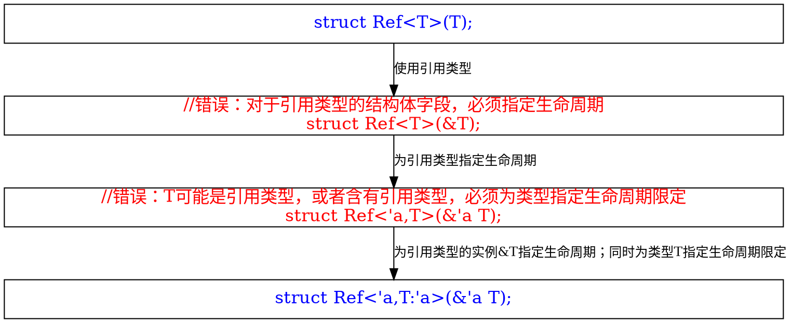

# 第19章 高级特征
## 1 不安全的Rust

不安全的Rust的超级力量：

* 解引用裸指针
* 调用不安全的函数/方法
* 访问/修改可变静态变量
* 实现不安全特性(trait)

<font color="red">`unsafe`不会关闭借用检查器或者禁用其他安全检查</font>

### 1.1 解引用裸指针

* 裸指针：`*const T`与`*mut T`
* 创建裸指针是安全的；解引用裸指针是不安全的
* 裸指针与智能指针的差别
  * 可忽略借用规则：可同时拥有同一个资源的不可变的和可变的裸指针；或者同时有多个指向相同位置的可变裸指针
  * 可以指向无效内存；可以为空
  * 不能实现任何自动清理功能

```rust

let mut num = 5;
// 可同时有同一个资源的可变和不可变的裸指针
let r1 = &num as *const i32;
let r2 = &mut num as *mut i32;

// 解引用裸指针的代码是不安全的，必须用unsafe包围
unsafe {
    println!("r1 is: {}", *r1);
    println!("r2 is: {}", *r2);
}

let address = 0x012345usize;
// 裸指针可指向无效位置
let r = address as *const i32;

```

### 1.2 调用不安全的函数/方法

* 调用不安全函数/方法的代码是不安全的，必须放在`unsafe`块中

```rust
unsafe fn dangerous() {}

unsafe {
    dangerous();
}
```

#### 1.2.1 包含不安全代码的安全函数/方法

```rust
fn split_at_mut(slice: &mut [i32], mid: usize) -> (&mut [i32], &mut [i32]) {
    let len = slice.len();
    assert!(mid <= len);
    // 编译错误：不能同时拥有两个可变引用
    (&mut slice[..mid],&mut slice[mid..])
}
```

* 可以使用不安全代码来实现上述函数

```rust
use std::slice;

fn split_at_mut(slice: &mut [i32], mid: usize) -> (&mut [i32], &mut [i32]) {
    let len = slice.len();
    let ptr = slice.as_mut_ptr();
    assert!(mid <= len);
    // 这是包含在安全函数中的不安全代码
    unsafe {
        (slice::from_raw_parts_mut(ptr, mid),
         slice::from_raw_parts_mut(ptr.offset(mid as isize), len - mid))
    }
}
```

#### 1.2.2 外部函数接口(Foreign Function Interface,FFI)

* 外部函数接口：让Rust可以与其他语言交互
* `extern`块中声明的函数总是不安全的
* `extern "C"`中的`"C"`是一种应用程序二进制接口（Application Binary Interface，ABI），`"C"`是最常见的ABI
* 以下是Rust调用C的示例

```rust
extern "C" {
    fn abs(input: i32) -> i32;
}

fn main() {
    unsafe {
        println!("Absolute value of -3 according to C: {}", abs(-3));
    }
}
```

* 以下是C调用Rust的示例。`#[no_mangle]`表示不允许对函数名称进行修饰

```rust
#[no_mangle]
pub extern "C" fn call_from_c() {
    println!("Just called a Rust function from C!");
}
```

### 1.3 访问/修改可变静态变量

* 全局变量又称作“静态变量”，其生命周期是`'static`，书写时通常省略生命周期
* 访问不可变的静态变量是安全的
* 访问和修改可变的静态变量是不安全的，相关代码必须放在`unsafe`块中

```rust
static mut COUNTER: u32 = 0;

fn add_to_count(inc: u32) {
    unsafe {
        COUNTER += inc;
    }
}

fn main() {
    add_to_count(3);

    unsafe {
        println!("COUNTER: {}", COUNTER);
    }
}
```

### 1.4 实现不安全的trait

* 至少有一个方法中包含编译器不能验证的不变量时`trait` 是不安全的，必须用`unsafe`修饰
* 实现不安全的`trait`时必须用`unsafe`修饰

```rust
unsafe trait Foo {
    // methods go here
}

unsafe impl Foo for i32 {
    // method implementations go here
}
```

## 2 高级生命周期

### 2.1 生命周期子类型

#### 2.1.1 第一步

* 有如下代码

```rust
struct Context<'a>(&'a str);//涉及引用时，结构体字段必须指定生命周期注解

struct Parser<'a> {
    //涉及引用时，结构体字段必须指定生命周期注解
    context: &'a Context<'a>,// 这里必须指定嵌套的生命周期注解
}

impl<'a> Parser<'a> {
    fn parse(&self) -> Result<(), &str> {
        Err(&self.context.0[1..])
    }
}
```

* 然后有以下代码

```rust
fn parse_context(context: Context) -> Result<(), &str> {
    Parser { context: &context }.parse()
}
```

* 上述代码不能编译
  * 根据第10章3.4.1节描述的生命周期省略规则，`Parser::parse()`方法省略了生命周期注解，返回值涉及的生命周期等于`self`的生命周期
  * `parse_context`函数结束时，`self`对应的临时对象的生命周期结束，所以`Parser::parse()`方法返回值的生命周期也结束，无法再作为`parse_context`函数的返回值

#### 2.1.2 第二步：使用两个生命周期注解

```rust
struct Context<'a>(&'a str);

struct Parser<'a,'s>{
	context: &'a Context<'s>
}

impl<'a,'s> Parser<'a,'s>{
	fn parse(&self) -> Result<(),&str>{
		Err(&self.context.0[1..])
	}
}
```

* 上述代码不能通过编译
  * 结构体`Parser`使用了两个生命周期注解，但没有指定它们的关系
  * 结构体实例有效期间，其字段必须有效，所以，生命周期`'s`必须不短于`'a`
  * 然而，代码没有指示`'s`和`'a`的关系

#### 2.1.3 第三步：指示两个生命周期注解的关系

```rust
struct Context<'a>(&'a str);

struct Parser<'a,'s:'a>{//使用两个生命周期注解，并且定义s不必a短
	context: &'a Context<'s>
}

impl<'a,'s> Parser<'a,'s>{
	fn parse(&self) -> Result<(),&'s str>{//必须指定返回值使用哪个生命周期
		Err(&self.context.0[1..])
	}
}
```

* `'s:'a`表示生命周期`'s`不比`'a`短，将冒号`:`理解成`>=`即可

### 2.2 对泛型类型的生命周期限定



### 2.3 特性对象的生命周期推导

* 特性对象的生命周期默认是`'static`
* 为特性指定生命周期的写法：`Box<Foo + 'a>`，其中`Foo`是特性类型

## 3 高级特性

### 3.1 关联类型

```rust
pub trait Iterator {
    type Item;
    fn next(&mut self) -> Option<Self::Item>;
}

impl Iterator for Counter {
    type Item = u32;
    fn next(&mut self) -> Option<Self::Item> {
    }
}

pub trait Iterator<T> {
    fn next(&mut self) -> Option<T>;
}
```

* 关联类型与泛型的差别：
  * 使用关联类型时，类型只能实现特性一次，关联到某种特定的类型
  * 使用泛型时，类型可以多次实现特性，每次指定不同的泛型类型参数

### 3.2 默认泛型类型参数

* 可通过实现标准库`std::ops`中的相关特性来实现运算符重载
* 标准库`std::ops`中的`Add`特性定义如下

```rust
trait Add<RHS=Self> {
    type Output;
    fn add(self, rhs: RHS) -> Self::Output;
}
```

* 其中的`RHS=Self`指示了默认的加数类型等于自身，这就是默认泛型类型参数
* 实现特性的时候，如果不给出泛型类型参数，则使用默认值，例如：

```rust
use std::ops::Add;

#[derive(Debug,PartialEq)]
struct Point {
    x: i32,
    y: i32,
}

impl Add for Point {
    type Output = Point;
    fn add(self, other: Point) -> Point {
        Point {
            x: self.x + other.x,
            y: self.y + other.y,
        }
    }
}
```

* 实现特性的时候，也可以给出泛型类型参数，以覆盖默认值，例如：

```rust
use std::ops::Add;

struct Millimeters(u32);
struct Meters(u32);

impl Add<Meters> for Millimeters {
    type Output = Millimeters;
    fn add(self, other: Meters) -> Millimeters {
        Millimeters(self.0 + (other.0 * 1000))
    }
}
```

* 默认参数类型主要用于如下两个方面
  1. 扩展类型而不破坏现有代码：通过覆盖泛型类型参数，可以扩展类型以处理新的参数类型，但不影响现有代码
  2. 在大部分用户都不需要的特定情况进行自定义：这是用途1的具体应用

### 3.3 用完全限定语法消除歧义

#### 3.3.1 特性方法的完全限定语法

* 不能阻止两个特性含有相同签名的方法；不能阻止类型同时实现这两个特性

```rust
trait Pilot {
    fn fly(&self);
}

trait Wizard {
    fn fly(&self);
}

struct Human;

impl Pilot for Human {
    fn fly(&self) {
        println!("This is your captain speaking.");
    }
}

impl Wizard for Human {
    fn fly(&self) {
        println!("Up!");
    }
}

impl Human {
    fn fly(&self) {
        println!("*waving arms furiously*");
    }
}
```

* 上述代码中，类型`Human`实现了`Pilot`和`Wizard`特性，这两个特性都含有`fly`方法；`Human`本身也含有`fly`方法
* 通过`Human`实例调用`fly`方法时，如何指示应该使用哪个`fly`方法？

```rust
fn main() {
    let person = Human;
    Pilot::fly(&person);//用特性名称限定应该调用哪个方法
    Wizard::fly(&person);//用特性名称限定应该调用哪个方法
    person.fly();// 也可以写成Human::fly(&person);但这样写复杂一些
}
```

#### 3.3.2 关联函数的完全限定语法

```rust
trait Animal {
    fn baby_name() -> String;
}

struct Dog;

impl Dog {
    fn baby_name() -> String {
        String::from("Spot")
    }
}

impl Animal for Dog {
    fn baby_name() -> String {
        String::from("puppy")
    }
}

fn main() {
    println!("A baby dog is called a {}", Dog::baby_name());
    println!("A baby dog is called a {}", <Dog as Animal>::baby_name());
}
```

#### 3.3.3 完全限定语法的一般形式

```rust
<Type as Trait>::function(receiver_if_method, next_arg, ...);
```

* 可省略可以从代码其他部分推导出来的部分，如
  * 省略`Type as`，变成`Trait::function(receiver_if_method, next_arg, ...)`
  * 省略`receiver_if_method`变成`<Type as Trait>::function(next_arg,...)`

### 3.4 父特性

```rust
use std::fmt;

trait OutlinePrint: fmt::Display {
    fn outline_print(&self) {
        // 调用父特性fmt::Display的to_string()方法
        let output = self.to_string();
        let len = output.len();
        println!("{}", "*".repeat(len + 4));
        println!("*{}*", " ".repeat(len + 2));
        println!("* {} *", output);
        println!("*{}*", " ".repeat(len + 2));
        println!("{}", "*".repeat(len + 4));
    }
}
```

* 上面的例子中，`fmt::Display`是`OutlinePrint`的父特性，为类型实现一个特性时，必须同时实现其父特性

```rust
struct Point {
    x: i32,
    y: i32,
}
// 这是错误的：Point没有实现OutlinePrint的父特性，所以不能实现子特性
impl OutlinePrint for Point {}
```

* 必须为`Point`类型实现`std::fmt::Display`，然后才能实现`OutlinePrint`

```rust
use std::fmt;

impl fmt::Display for Point {
    fn fmt(&self, f: &mut fmt::Formatter) -> fmt::Result {
        write!(f, "({}, {})", self.x, self.y)
    }
}
```

### 3.5 使用newtype模式绕过孤儿规则

* 孤儿规则：特性和类型两者中至少有一个在本地时，才能为类型实现特性，不能为其他包中的类型实现其他包中的特性
* `newtype`模式：用元组结构体封装其他包中的类型，然后对这个元组结构体实现其他包中的特性

```rust
use std::fmt;
struct Wrapper(Vec<String>);

// 对封装了其他包中类型的元组结构体实现其他包中的特性
impl fmt::Display for Wrapper {
    fn fmt(&self, f: &mut fmt::Formatter) -> fmt::Result {
        // 这里用self.0引用被元组结构体封装的Vec<String>类型
        write!(f, "[{}]", self.0.join(", "))
    }
}

// 实现Deref特性，让类型变成智能指针
impl std::ops::Deref for Wrapper{
    type Target = Vec<String>;
    fn deref(&self)->&Self::Target{
        &self.0
    }
}

fn main() {
    let w = Wrapper(vec![String::from("hello"), String::from("world")]);
    println!("w = {}", w);//这里就可以使用fmt::Display特性了

    let x = vec![String::from("a")];
    for y in x.iter(){println!("{}",y);}

    let w = Wrapper(x);
    // 必须实现Deref特性，才可以这样写
    // 解引用强制多态：
    // 1 类型Wrapper没有iter()方法
    // 2 对其调用Deref特性的deref方法，得到&Vec<String>
    // 3 &Vec<String>含有iter()方法，使用之
    for y in w.iter(){println!("{}",y);}
}
```

## 4 高级类型

### 4.1 类型别名

```rust
type Kilometers = i32;

let x: i32 = 5;
let y: Kilometers = 5;

println!("x + y = {}", x + y);
```

* `std::io::Result`就是`std::result::Result<T,std::io::Error>`的别名

### 4.2 空类型

* `!`表示空类型（empty type，或者never type）
* 从不返回的函数称作**发散函数（diverging functions）**
* 发散函数的返回类型表示为`!`

#### 4.2.1 示例1：发散函数

```rust
fn bar() -> ! {
    // --snip--
}
```

#### 4.2.2 示例2：`match`中的空类型

```rust
fn main(){
    let value = None;
    let mut guess:u32;
    loop{
        guess = match  value{
            Some(v) => v,
            None => break,
        };
        break;
    }
    println!("{}",guess);
}
```

* `Ok`分支的返回值类型是`u32`
* `Err`分支返回空类型，而空类型`!`可以强转为其他任何类型
* 最终`match`表达式的类型是`u32`
* `Err`分支的`break`不返回值，`guess`没有被赋值，控制返回到外层的`loop`循环语句，循环被中断
* 流程到达最后的`println`时，`guess`可能还没有初始化，所以编译会出错：使用可能未初始化的`guess`
* 在声明`guess`的时候给出初始值就可以通过编译

#### 4.2.3 示例3：用于`panic!`的空类型

```rust
impl<T> Option<T> {
    pub fn unwrap(self) -> T {
        match self {
            Some(val) => val,
            None => panic!("called `Option::unwrap()` on a `None` value"),
        }
    }
}
```

#### 4.2.4 示例4：`loop`中的空类型

```rust
let x = loop{
    break;
};
println!("{:?}",x);
```

* `loop`表达式的类型是空类型，所以`x`也是空类型
* `println!`中必须使用`{:?}`，不能使用`{}`，因为空类型没有实现`std::fmt::Display`特性

### 4.3 动态大小类型与`Sized`特性

* 动态大小类型（dynamically sized types），缩写为`DST`，也称作`unsized types`
* `str`就是动态大小类型，不能创建`str`类型的变量
* 字面字符串的类型是`&str`，是一种固定大小的引用类型
* `&T`大小通常为`usize`大小，即一个指针大小
* `&str`要存储`str`的地址和大小，所以`&str`的大小是两个`usize`的大小，`&str`是一种肥指针(fat pointer)

<font color="red">

* **必须用某种指针类型（各种引用、原始指针、Box<T>、Rc<T>等）指向动态大小类型的值**
* **特性是动态大小类型：实现特性的具体类型无法在编译时确定，所以特性值的大小无法在编译时确定**
* `Sized`特性表示在编译时知道大小的类型，编译器会自动为每个在编译时知道大小的类型实现`Sized`特性
* **编译器会自动为每个泛型类型参数增加`Sized`特性限定**
  * `fn generic<T>(t: T) {}`
  * 实际上被处理为`fn generic<T: Sized>(t: T) {}`
* `?Sized`表示也可用于大小不确定类型（动态大小类型）：`fn generic<T: ?Sized>(t: &T) {}`
  * 注意：`t`的类型从`T`变成了`&T`：`T`的大小可能是不确定的；而`&T`的大小是确定的
</font>

## 5 高级函数与闭包

### 5.1 函数指针

```rust
fn add_one(x: i32) -> i32 {
    x + 1
}

fn do_twice(f: fn(i32) -> i32, arg: i32) -> i32 {
    f(arg) + f(arg)
}

fn twice_do<T>(f: T,arg: i32) -> i32 where T:Fn(i32) -> i32{
    f(arg) + f(arg)
}

fn demo1(){
    // 函数名作为函数指针使用
    let answer = do_twice(add_one, 5);
    println!("The answer is: {}", answer);

    // 函数名作为Fn特性使用
    let answer = twice_do(add_one, 5);
    println!("The answer is: {}", answer);

    // 闭包作为函数指针使用
    let answer = do_twice(|arg: i32|->i32 { arg + 1}, 5);
    let answer = do_twice(|x|x+1, 5);
    println!("The answer is: {}", answer);

    // 闭包作为Fn特性使用
    let answer = twice_do(|arg: i32|->i32 { arg + 1}, 5);
    let answer = twice_do(|x|x+1, 5);
    println!("The answer is: {}", answer);
}

pub fn main() {
    demo1();
}
```

* 函数名称可以作为函数指针、`Fn`特性使用
* 闭包可以作为函数指针、`Fn`特性使用
* 在`Rust`中，形式参数使用函数指针、`Fn`系列特性都可以；实际参数使用函数名称、闭包都可以
* 与外部代码（如C语言）交互时，必须使用函数指针

### 5.2 返回闭包

```rust
fn returns_closure() -> Fn(i32) -> i32 {
    |x|x+1 // 错误：Fn没有实现Sized特性约束
}
```

* 闭包不能直接作为`Fn`系列特性返回：特性是大小不确定类型，不能直接使用
* 可以用`Box`封装闭包

```rust
fn returns_closure() -> Box<Fn(i32) -> i32> {
    Box::new(|x|x+1)
}
println!("The answer is: {}", returns_closure()(5));
```