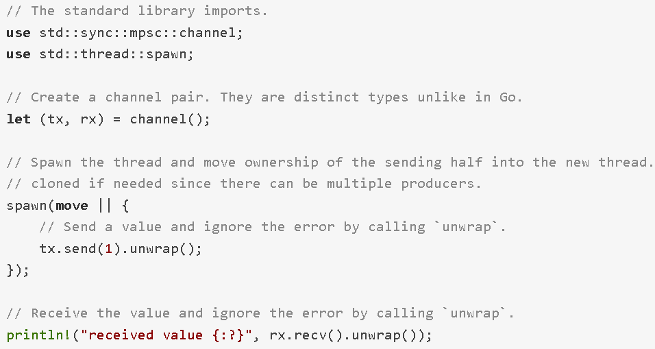

# Rust中实现Go通道

文章来源：[https://www.tuicool.com/articles/iqaym2Z](https://www.tuicool.com/articles/iqaym2Z)

## Go中的通道

* 基本功能
  * 内置的通道可用于任意类型
  * 可声明为只收/只发类型
  * 使用make创建通道，可给定通道容量
  * 零容量的通道非缓冲；非零容量的通道是缓冲的
  * 用箭头运算符<-实现接收/发送
* 缓冲与非缓冲
* 用range对通道进行迭代
* 用close关闭通道
* 用select对一组通道进行操作

## Rust标准库中的通道

- MPSC: multiple producers single consumer
- 没有接收端时send不会阻塞



## crossbeam-channel

- [https://github.com/crossbeam-rs/crossbeam-channel](https://github.com/crossbeam-rs/crossbeam-channel)

### 基本使用

```rust
use crossbeam_channel as channel;

let (tx,rx) = channel::unbounded();//创建非缓冲的通道
let (s,r) = channel::bounded(1);// 创建缓冲的通道,容量为1

for i in 0..100 {
      // 可以向非缓冲的通道发送无限数量的数据,而不会阻塞(不同于Go)
      tx.send(i);
}

println!("{:?}", rx.recv());// 以阻塞方式接收

s.send(1);
s.send(2);// 这个调用将阻塞,直到上一个发送的数据被收取
```

### 阻塞/非阻塞

* 发送
  * 非缓冲通道：可以无限发送、不阻塞
  * 缓冲通道：通道满的时候发送被阻塞
* 接收：`recv()`和`try_recv()`

### 迭代与关闭

* 实现了`Iterator`特性，可以用`for`语句进行迭代
* 发送端实现了`Drop`特性，离开作用域时自动关闭，使得对接收端的迭代停止
* 可以调用`std::mem::drop()`方法来手动调用`Drop`特性的`drop`方法，这相当于Go中的`close`

```rust
use crossbeam_channel as channel;

let (tx, rx) = channel::unbounded();
tx.send(1);
tx.send(2);

drop(tx);//显式调用drop方法

// 将输出:
// 1
// 2
for item in rx {
      println!("{:?}", item);
}
```

### select

```rust
// 必须声明宏使用,因为标准库中也有一个select宏
#[macro_use]
extern crate crossbeam_channel;
use crossbeam_channel as channel;
let (tx1,rx1) = channel::unbounded();
let (tx2,rx2) = channel::unbounded();
tx1.send(1);
// 这里会随机选择一个操作,因为两个操作都准备好了,都可以进行
select! {
     recv(rx1, val) => println!("got value {:?}", val),
     send(tx2, 2) => (),
}
```

### 综合示例

```rust
extern crate crossbeam_channel;
extern crate threadpool;

use std::thread::sleep;
use std::time::Duration;

use crossbeam_channel as channel;
use threadpool::ThreadPool;

fn work(tx: channel::Sender<usize>, task: usize) {
	sleep(Duration::new(1, 0));
	tx.send(task);
}

fn main() {
	const TASKS: usize = 100;

	let (tx, rx) = channel::unbounded();
	let pool = ThreadPool::new(4);

	for i in 0..TASKS {
		let tx = tx.clone();
		pool.execute(move || { work(tx, i);});
	}

	drop(tx);

	for i in rx {
		if i % 5 == 0 {
			println!("done with {}% of the work", i);
		}
	}

	println!("done with all of the work");
}
```
